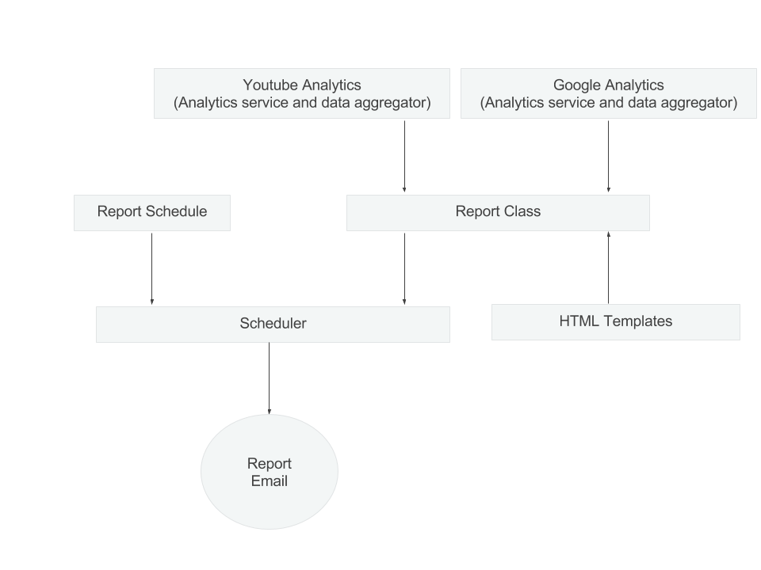

Architectural Overview
=====================

This is an overview of how the statsdash project works at a high level. You can see the work flow in the diagram below.

There are two analytics services, Google Analytics and Youtube Analytics. Both of these analytics services are contained within their own folder. Each one contains an analytics file, that creates the connection to the service and runs the queries, an individual config and a data aggregator which formats the data gathered into specified data tables. 

The report class, calls to these analytics services through the data aggregator class. This returns the data tables in the format used for the HTML templates. The report class will render this data in the template and return the HTML. This can then be sent out as an email. 

The scheduler runs over the report schedule and checks when a report needs to run. If it needs to run and the data is available, it initialises the relevant report object, generates the html and sends the email.

